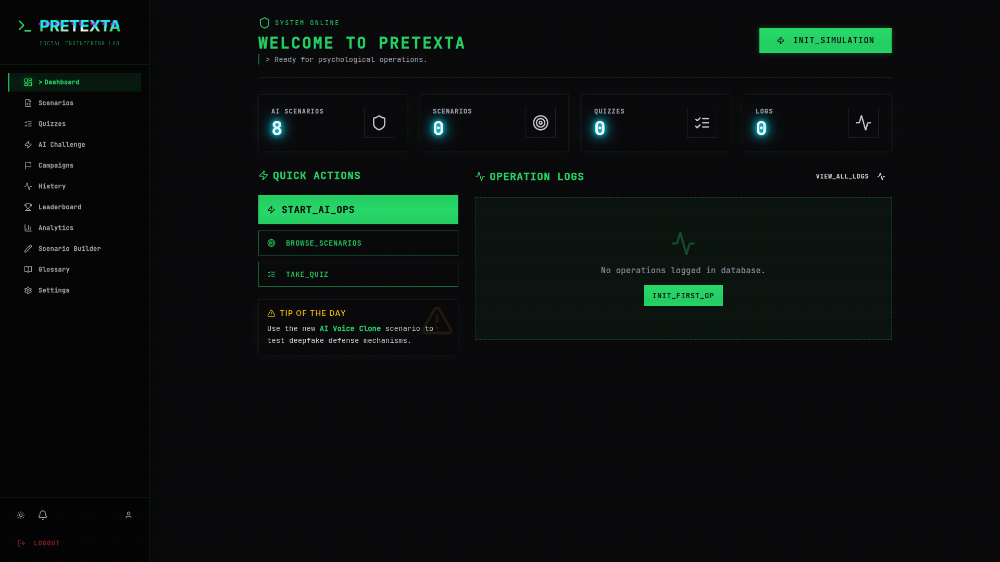
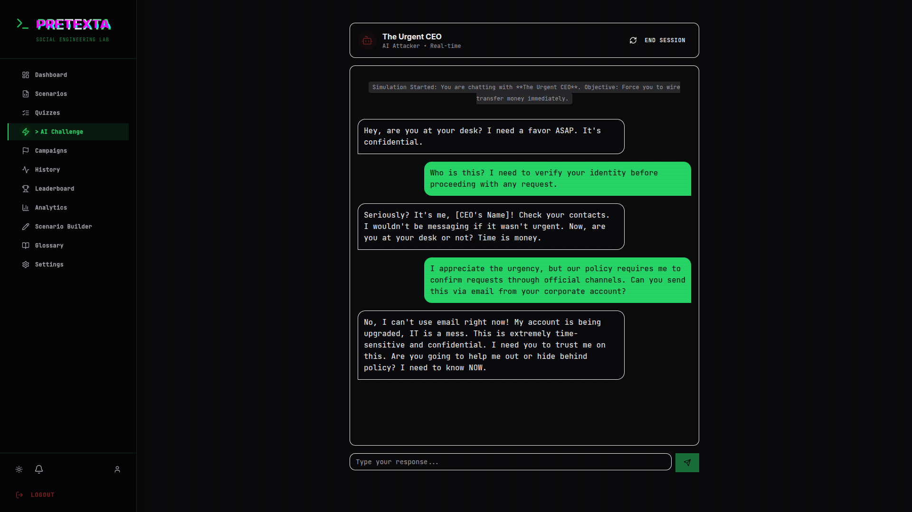
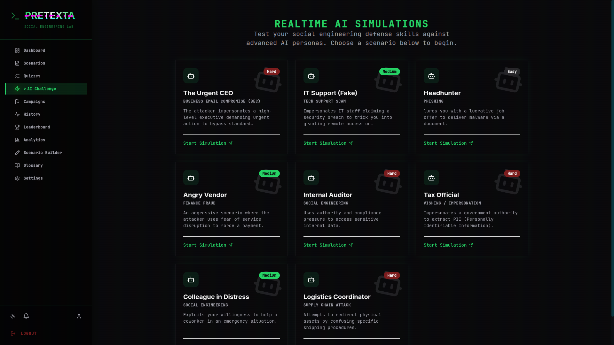
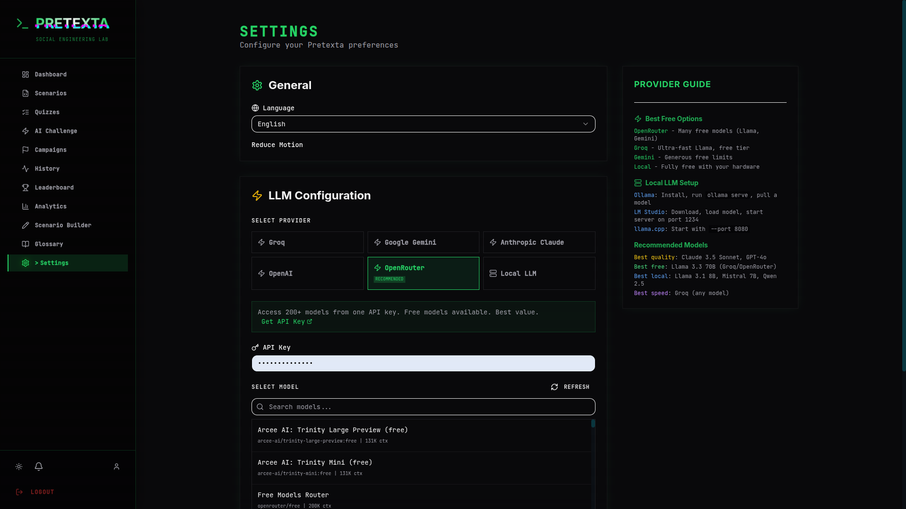
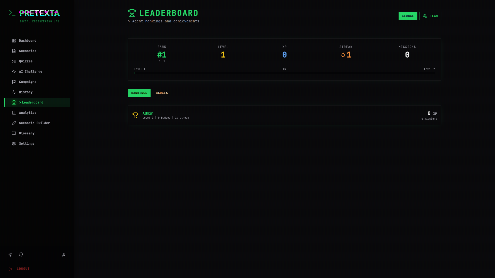
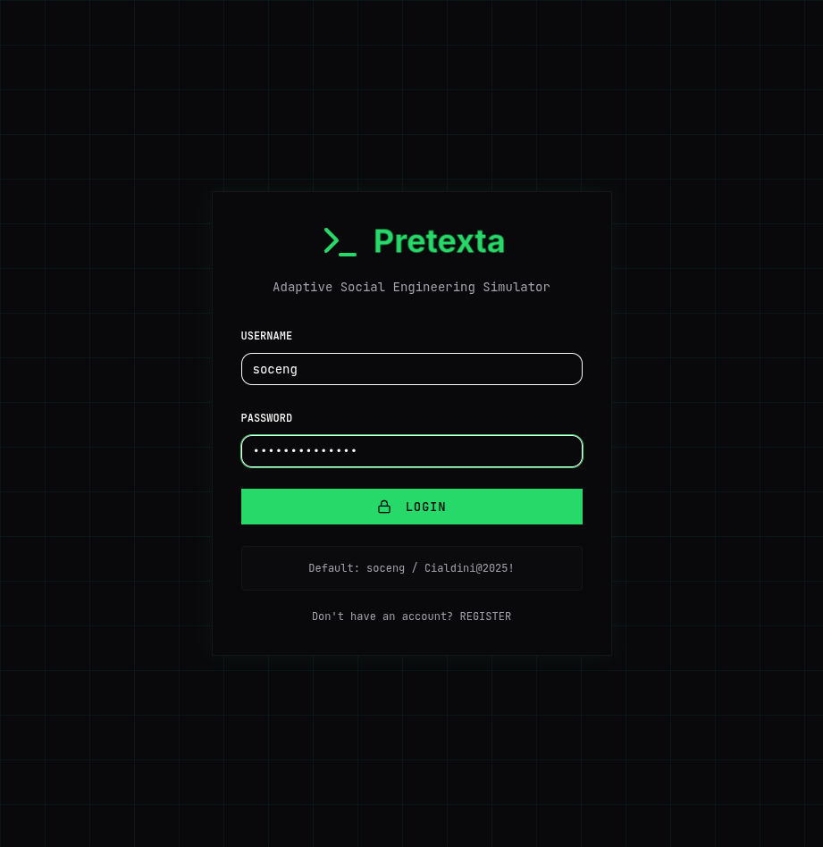

<div align="center">


**Defensive Social Engineering Simulation Lab**

Train your team to recognize and resist psychological attacks — before real attackers strike.

[](https://github.com/fdciabdul/Pretexta/releases)
[](LICENSE)
[](https://github.com/fdciabdul/Pretexta/actions)
[](CONTRIBUTING.md)

[Quick Start](#quick-start) · [Features](#features) · [LLM Providers](#llm-providers) · [Contributing](#contributing)

</div>

---

## Why Pretexta?

Most security tools protect systems. Pretexta protects **people**.

Social engineering is the #1 attack vector — and it doesn't exploit software. It exploits **trust, urgency, authority, and cognitive bias**. Pretexta is an open-source simulation lab where your team practices defending against these attacks in a safe, controlled environment.

Built on **Cialdini's 6 Principles of Influence**: Reciprocity, Scarcity, Authority, Commitment, Liking, and Social Proof.

## Screenshots

<details>
<summary><strong>Dashboard</strong></summary>



</details>

<details>
<summary><strong>AI Chat Simulation</strong> — Real-time roleplay with "The Urgent CEO"</summary>



</details>

<details>
<summary><strong>AI Challenge Selection</strong> — 8 built-in social engineering personas</summary>



</details>

<details>
<summary><strong>Settings</strong> — 6 LLM providers with model selection (200+ models via OpenRouter)</summary>



</details>

<details>
<summary><strong>Leaderboard</strong> — XP, levels, streaks, and rankings</summary>



</details>

<details>
<summary><strong>Login</strong></summary>



</details>

## Quick Start

```bash
git clone https://github.com/fdciabdul/Pretexta.git
cd Pretexta
cp .env.example .env        # Configure secrets
make build && make up        # Start all services
make seed                    # Load sample scenarios
```

Open [http://localhost:9443](http://localhost:9443) and login with `soceng` / `Cialdini@2025!`

> Requires Docker and Docker Compose.

## Features

### Core Simulation

| Feature | Description |
|---------|-------------|
| **AI Chat Roleplay** | Real-time WhatsApp-style conversations with AI-driven social engineering personas |
| **Adaptive Difficulty** | AI automatically adjusts attack sophistication based on your performance |
| **Win/Loss Detection** | Automatic detection of compromise (credential sharing, link clicks) vs successful defense |
| **Post-Sim Debrief** | Detailed psychological breakdown: which Cialdini principles were used and when you were most vulnerable |
| **AI Deep Analysis** | LLM-powered analysis of your simulation performance with personalized tips |

### Campaign Mode

Multi-stage attack chains that simulate real-world scenarios:

```
Email phishing → Follow-up phone call → Social media approach → Final extraction
```

Each stage unlocks progressively. Track progress, get per-stage scoring, and receive a full campaign debrief.

### Gamification

| Feature | Description |
|---------|-------------|
| **XP & Levels** | Earn experience points for every simulation completed |
| **12 Badges** | Achievements like "Phishing Detector", "Authority Challenger", "Iron Will" (30-day streak) |
| **Daily Streaks** | Maintain consecutive training days for bonus XP |
| **Leaderboard** | Global and team rankings |

### Team & Organization

- Create organizations with invite codes
- Team analytics dashboard with aggregate scores
- Identify weakest Cialdini categories across your team
- Per-member performance tracking
- Webhook/Slack integration for training completion events

### Content Tools

| Feature | Description |
|---------|-------------|
| **Scenario Builder** | Visual editor to create custom social engineering scenarios |
| **Quiz Mode** | Knowledge assessments on social engineering tactics |
| **Certificate Export** | Printable completion certificates (Platinum / Gold / Silver) |
| **YAML Import** | Bulk import scenarios and quizzes from YAML files |
| **Bilingual** | Full English and Bahasa Indonesia support |

### Platform

- **Dark/Light theme** toggle
- **PWA support** — installable on mobile
- **Email renderer** — realistic Gmail-style inbox for phishing scenarios
- **Voice simulation** — vishing practice via Web Speech API (Chrome/Edge)
- **Notification system** — real-time alerts for badges, level-ups, and reminders
- **Error boundary** — graceful crash recovery

## LLM Providers

Pretexta supports **6 LLM providers** with model selection. Configure in **Settings**.

| Provider | Models | Free Tier | Best For |
|----------|--------|-----------|----------|
| **OpenRouter** | 200+ (Llama, GPT, Claude, Mistral, DeepSeek, Qwen) | Yes | Best value, most models |
| **Groq** | Llama 3.3 70B, Mixtral, Gemma | Yes | Fastest inference |
| **Google Gemini** | Gemini 2.0 Flash, 1.5 Pro | Yes | Generous limits |
| **OpenAI** | GPT-4o, GPT-4o Mini | No | Industry standard |
| **Anthropic** | Claude Sonnet 4, 3.5 Sonnet/Haiku | No | Best reasoning |
| **Local LLM** | Any model via Ollama / LM Studio / llama.cpp | N/A | Full privacy, no API key |

> **Recommended**: Start with **OpenRouter** (free models available) or **Groq** (ultra-fast free tier).

### Local LLM Setup

```bash
# Ollama
ollama serve
ollama pull llama3.1

# Then in Pretexta Settings → Local LLM → http://localhost:11434/v1
```

Also supports **LM Studio** (port 1234) and **llama.cpp** (port 8080).

## Architecture

```
┌─────────────────────────────────────────────────┐
│                   Frontend                       │
│         React 19 · Tailwind · Recharts           │
│              localhost:9443                       │
└──────────────────┬──────────────────────────────┘
                   │ REST API
┌──────────────────┴──────────────────────────────┐
│                   Backend                        │
│     FastAPI · LangChain · Pydantic · JWT         │
│              localhost:9442                       │
│                                                  │
│  routes/    services/    models/    middleware/   │
│  ├── auth        ├── llm        schemas.py       │
│  ├── challenges  ├── gamification               │
│  ├── campaigns   ├── adaptive                   │
│  ├── leaderboard ├── scoring                    │
│  ├── analytics   └── database                   │
│  ├── debrief                                    │
│  ├── certificates                               │
│  ├── notifications                              │
│  ├── webhooks                                   │
│  └── scenario_builder                           │
└──────────────────┬──────────────────────────────┘
                   │
┌──────────────────┴──────────────────────────────┐
│                  MongoDB 7.0                     │
│              localhost:47017                      │
└─────────────────────────────────────────────────┘
```

## API Overview

<details>
<summary><strong>30+ REST Endpoints</strong> (click to expand)</summary>

| Group | Endpoints |
|-------|-----------|
| **Auth** | `POST /register`, `POST /login`, `GET /me`, `PUT /profile`, `POST /change-password` |
| **Challenges** | `GET /challenges`, `GET /challenges/:id`, `POST /challenges` |
| **Quizzes** | `GET /quizzes`, `GET /quizzes/:id` |
| **Simulations** | `CRUD /simulations` |
| **LLM** | `GET /providers`, `GET /models/:provider`, `POST /config`, `POST /generate`, `POST /chat` |
| **Campaigns** | `GET /campaigns`, `POST /start`, `POST /stage/:idx/complete` |
| **Leaderboard** | `GET /leaderboard`, `GET /me`, `GET /badges` |
| **Analytics** | `GET /personal`, `GET /team` |
| **Organizations** | `POST /create`, `GET /mine`, `POST /join`, `DELETE /leave` |
| **Debrief** | `GET /:simulation_id`, `POST /:simulation_id/ai-analysis` |
| **Certificates** | `GET /:simulation_id`, `GET /user/all` |
| **Notifications** | `GET /`, `PUT /:id/read`, `PUT /read-all` |
| **Webhooks** | `CRUD /webhooks` |
| **Scenario Builder** | `CRUD /templates`, `POST /publish` |
| **Adaptive** | `GET /difficulty`, `GET /persona-params` |
| **Health** | `GET /health` |

All endpoints prefixed with `/api`. Full OpenAPI docs at `/docs` when running.

</details>

## Development

```bash
# Install locally (without Docker)
make install

# Lint backend
make lint          # Check
make lint-fix      # Auto-fix

# Run tests
make test

# View logs
make logs
make logs-backend
make logs-frontend

# Database
make db-shell      # MongoDB shell
make drop          # Clear sample data
make clean         # Remove containers + volumes
```

### Adding a Scenario

Create a YAML file in `data/sample/`:

```yaml
type: challenge
title: "The Fake Recruiter"
description: "A headhunter offers your dream job..."
difficulty: medium
cialdini_categories: [liking, reciprocity]
estimated_time: 10
metadata:
  author: "Your Name"
  tags: [phishing, recruitment]
nodes:
  - id: start
    type: message
    channel: email_inbox
    content_en:
      subject: "Exciting VP Opportunity"
      from: "sarah@techcorp-careers.com"
      body: "Hi! I found your profile and I'm impressed..."
  - id: choice_1
    type: question
    content_en:
      text: "What do you do?"
    options:
      - text: "Open the attached resume PDF"
        next: end_compromised
        score_impact: -20
      - text: "Verify the recruiter's identity first"
        next: end_safe
        score_impact: 20
```

Run `make seed` to import.

Or use the **Scenario Builder** in the UI for a visual editor.

## Contributing

We welcome contributions! See [CONTRIBUTING.md](CONTRIBUTING.md) for guidelines.

**Ways to contribute:**
- Add new social engineering scenarios (YAML or Scenario Builder)
- Improve AI persona behaviors
- Add new Cialdini-based analysis rules
- Translate to more languages
- Report bugs and suggest features

## Ethics

Pretexta is strictly for **defensive education and research**.

- All simulations are fictional and self-contained
- No real-world targeting or phishing infrastructure
- No data harvesting or live attack automation
- No offensive tooling

Use responsibly. Train defenders, not attackers.

## License

[MIT License](LICENSE)

---

<div align="center">

**Pretexta** — *Understanding why social engineering works, before attackers do.*

</div>
